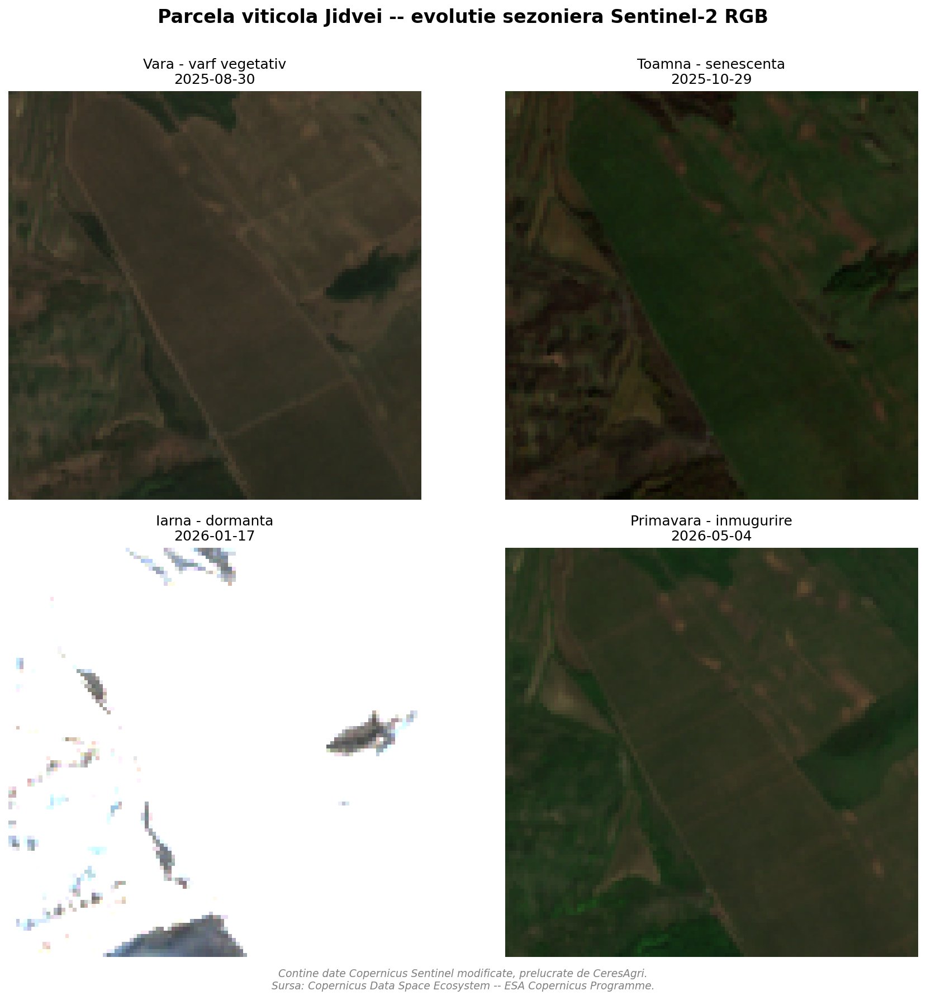
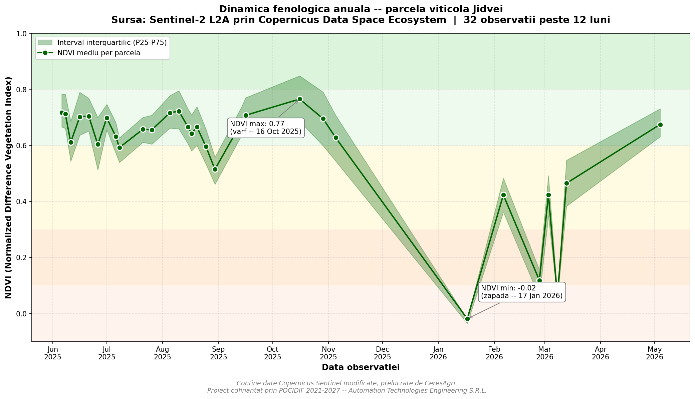
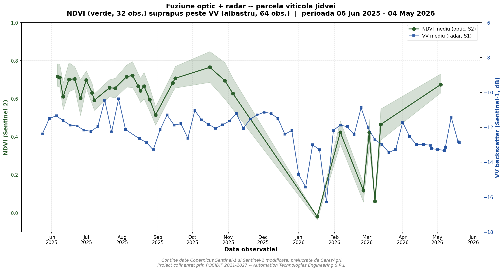
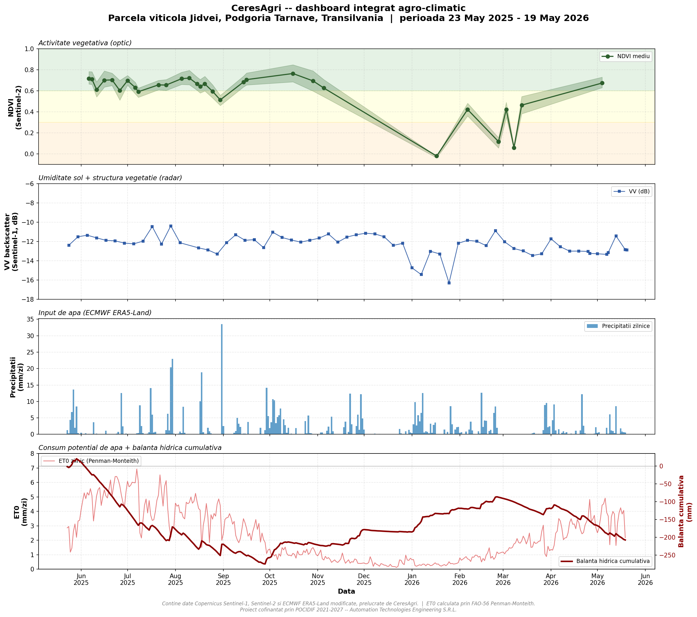

## 3. Arhitectura tehnică a prototipului

### 3.1 Schema de arhitectură

Prototipul implementează o arhitectură **modulară, în straturi orizontale**,
unde fiecare strat are responsabilități clar delimitate și comunică cu
straturile vecine prin interfețe stabile. Această separare permite testarea
independentă a componentelor, înlocuirea unui modul fără impact pe restul
sistemului și scalarea ulterioară la nivel de producție.

Fluxul de date, de la sursele Copernicus până la livrabilul final, este
următorul:

```text
[Surse de date Copernicus]
       │
       │   Sentinel-1     Sentinel-2     ERA5-Land
       │   (radar SAR)    (optic)        (meteo)
       ▼
[Stratul de acces autenticat]
       │   sentinel_client.py     - OAuth2 + STAC catalog CDSE
       │   ecmwf_climate.py       - CDS API client
       ▼
[Stratul de ingestie procesată]
       │   sentinel_download.py   - evalscript RGB
       │   vegetation_indices.py  - evalscript NDVI
       │   sentinel1_radar.py     - evalscript VV/VH dB
       │   ecmwf_climate.py       - CSV multi-fisier
       ▼
[Stratul de agregare per parcela]
       │   time_series.py              - statistici parcela pe scena
       │   ecmwf_climate.py            - agregare orara → zilnica
       │   evapotranspiration.py       - FAO-56 Penman-Monteith
       ▼
[Stratul de iesire si vizualizare]
       │   scripts/plot_*.py     - figuri PDF + PNG
       │   data/*/*.csv          - serii temporale exportabile
       │   notebooks/*.ipynb     - validare interactiva
       ▼
[Livrabile finale]
           - Figuri stiintifice (4 PDF-uri principale)
           - CSV-uri reproductibile (3 fisiere)
           - Dashboard integrat
```

Acest design respectă principiul **separation of concerns** — fiecare modul
face un singur lucru și îl face bine. Pipeline-ul nu este monolitic: oricare
strat poate fi înlocuit fără să afecteze celelalte, ceea ce este critic
pentru evoluția de la TRL 3 la TRL 6.

### 3.2 Stack tehnologic

Selecția stack-ului tehnologic a urmărit trei criterii: **maturitate**
(biblioteci cu utilizare largă, întreținute activ), **standardizare**
(formate și protocoale deschise) și **reproductibilitate** (versiuni
explicite, lockfile-uri pentru toate dependențele).

| Categorie | Tehnologie | Versiune | Rol |
|---|---|---|---|
| Limbaj | Python | 3.13 | Limbajul de programare principal |
| Manager pachete | uv (Astral) | latest | Instalare reproductibilă a dependențelor |
| Procesare raster | rasterio | 1.4+ | Citire/scriere GeoTIFF geo-referențiat |
| Procesare vector | shapely, geopandas, pyproj | 2.0+, 1.0+, 3.7+ | Operații pe geometrii (parcele) |
| Multi-dim arrays | xarray, numpy | 2024.10+, 2.0+ | Lucru cu date multi-dimensionale |
| Date științifice | pandas, scipy, scikit-learn | 2.2+, 1.14+, 1.5+ | Analiză și statistici |
| Acces Sentinel | sentinelhub, pystac-client | 3.11+, 0.8+ | API client + STAC pentru CDSE |
| Acces meteo | cdsapi | 0.7+ | Client Copernicus Climate Data Store |
| Modelare agronomică | pyfao56 | 1.4+ | Calcul FAO-56 (referință USDA-ARS) |
| Vizualizare | matplotlib, seaborn | 3.9+, 0.13+ | Generare figuri publicabile |
| Calitate cod | ruff, mypy | latest | Linting + verificare statică |
| Testare | pytest | 8.3+ | Cadrul de testare automată |

**Infrastructură externă utilizată:**

- **Copernicus Data Space Ecosystem (CDSE)** — punct de acces oficial pentru
  Sentinel-1 și Sentinel-2, cu API Sentinel Hub
  (`sh.dataspace.copernicus.eu`). Autentificare OAuth2 cu client credentials.
- **Copernicus Climate Data Store (CDS)** — punct de acces pentru
  ERA5-Land, prin API REST. Autentificare prin API key personală.
- **GitHub** (`github.com/AutomationTechnologiesEngineering/ceresagri`) —
  versionare, backup și hosting al codului sursă.

### 3.3 Organizarea codului

Codul prototipului este structurat conform convențiilor Python standard,
folosind separation of concerns între cod reutilizabil, scripturi
operaționale și notebook-uri de validare.

**Pachetul Python `ceresagri/`** conține modulele core, instalabile prin
`uv sync` ca pachet editabil:

- `config.py` — încărcare centralizată a credențialelor din `.env` cu
  validare; toate celelalte module importă de aici pentru a evita citirea
  duplicată a configurației și pentru a fi clare despre dependențele
  externe;
- `sentinel_client.py` — client OAuth2 + interogare catalog STAC pentru
  Sentinel-2;
- `sentinel_download.py` — descărcarea imaginilor RGB cu evalscript
  personalizat;
- `vegetation_indices.py` — calcul NDVI cu masking de date invalide;
- `time_series.py` — extragere statistici per parcelă pe serii temporale;
- `sentinel1_radar.py` — pipeline complet Sentinel-1 (VV/VH);
- `ecmwf_climate.py` — descărcare și procesare date ERA5-Land;
- `evapotranspiration.py` — implementare FAO-56 Penman-Monteith.

**Scripturile `scripts/`** sunt programe de un singur scop, lansate manual,
care folosesc pachetul `ceresagri` ca dependență. Acestea sunt
"orchestratori" — generează figuri, fac verificări ad-hoc, rulează validări
specifice. Exemple: `plot_ndvi_timeseries.py`, `plot_integrated_dashboard.py`.

**Notebook-urile `notebooks/`** servesc ca medii de validare experimentală
și demonstrație vizuală. `01_sentinel2_first_steps.ipynb` documentează
primul flux end-to-end al prototipului, cu cod, comentarii și grafice
încorporate, format util atât pentru evaluatori cât și pentru
formarea noilor membri ai echipei.

**Configurația proiectului `pyproject.toml`** respectă standardul PEP 621 și
declară:

- Dependențele runtime ale proiectului (rasterio, sentinelhub, pyfao56 etc.);
- Dependențele de dezvoltare (pytest, ruff, mypy);
- Versiunea Python necesară (`>=3.13,<3.14`);
- Configurarea linter-ului Ruff cu reguli adaptate la cod științific
  (line-length 100, ignorare regulilor prea agresive pentru prototipare);
- Configurarea pytest pentru testare automată;
- Configurarea sistemului de build (`hatchling`), care permite instalarea
  pachetului în mod editabil în mediul virtual.

### 3.4 Modelul de date

Prototipul utilizează **trei nivele de date** cu strategii diferite de
stocare și versionare:

**Nivelul 1 — date brute descărcate (volume mari, neversionate):**

- Imagini RGB Sentinel-2 (PNG, ~50-150 KB per scenă, ~30-50 scene)
- Hărți NDVI Sentinel-2 (GeoTIFF float32, ~50-100 KB per scenă)
- Hărți radar Sentinel-1 (GeoTIFF cu 2 benzi float32, ~80-150 KB per scenă)
- ZIP-uri ERA5-Land cu CSV-uri orare (~500 KB-1 MB)

Aceste fișiere sunt salvate local în `data/images/`, `data/ndvi/`,
`data/sentinel1/`, `data/ecmwf/` și **sunt excluse explicit din Git** prin
`.gitignore`. Motivația: sunt voluminoase, sunt reproductibile prin rularea
pipeline-ului, iar versionarea lor ar mări inutil dimensiunea repository-ului.

**Nivelul 2 — date agregate per parcelă (volume mici, versionate):**

- `data/ndvi/jidvei_ndvi_timeseries.csv` — 32 rânduri × 10 coloane,
  statistici NDVI per scenă;
- `data/sentinel1/jidvei_s1_timeseries.csv` — 64 rânduri × 10 coloane,
  statistici VV/VH per scenă;
- `data/ecmwf/jidvei_era5land_daily.csv` — 362 rânduri × 11 coloane, date
  meteo zilnice;
- `data/ecmwf/jidvei_climate_et0.csv` — 362 rânduri × 13 coloane, climat
  plus ET₀ și balanță hidrică;
- `data/parcels/jidvei_test_parcel.geojson` — geometria parcelei (4
  vertexes plus închidere).

Aceste fișiere **sunt versionate în Git** pentru că sunt mici (< 100 KB
total), reprezintă output-ul principal al pipeline-ului și permit
reproductibilitatea analizei fără reluarea costisitoare a descărcărilor.

**Nivelul 3 — livrabile finale (versionate):**

- Figuri PDF și PNG în `data/figures/`:
  - `jidvei_seasonal_rgb.pdf/.png` — comparație sezonieră 4 imagini RGB;
  - `ndvi_timeseries_jidvei.pdf/.png` — curba fenologică anuală NDVI;
  - `fusion_optic_radar_jidvei.pdf/.png` — fuziune NDVI + VV radar;
  - `dashboard_integrat_jidvei.pdf/.png` — dashboard agro-climatic complet.

Aceste figuri sunt versionate ca artefacte de referință — ele constituie
dovada vizuală a funcționării pipeline-ului și sunt direct citate în acest
raport tehnic.

### 3.5 Decizii de inginerie semnificative

Pe parcursul dezvoltării prototipului, au fost luate câteva decizii tehnice
care merită explicate, întrucât reflectă învățături relevante pentru
implementarea POCIDIF:

**Selecția uv față de pip/conda.** Managerul de pachete uv (Astral, lansat
2024) a fost ales în locul pip clasic sau conda pentru viteza de
instalare (de 10-100× mai rapid), pentru gestionarea integrată a versiunii
Python și pentru lockfile-ul reproductibil cross-platform (`uv.lock`). În
contextul unei echipe distribuite și al unei infrastructuri CI/CD viitoare,
această decizie reduce semnificativ frecările operaționale.

**Format CSV preferat față de NetCDF pentru date ECMWF.** API-ul Copernicus
Climate Data Store oferă atât format NetCDF cât și CSV. Inițial s-a încercat
NetCDF (standardul științific), dar implementarea ARCO Zarr a CDS din 2024
returnează NetCDF-uri împachetate în ZIP-uri cu probleme de file handles pe
Windows. CSV-urile, deși mai mari ca dimensiune, sunt **mult mai robuste,
verificabile manual și nu necesită dependențe externe** (`netcdf4`,
`h5netcdf`). Pentru un sistem care va opera pe Windows, Linux și posibil
servere cloud, această decizie elimină o sursă majoră de bug-uri.

**Endpoint Sentinel Hub față de Sentinel Hub Process API direct.** Am ales
biblioteca Python `sentinelhub-py` în loc de cererile HTTP brute, pentru
gestionarea automată a token-urilor OAuth2, retry-urilor și a paginării.
Costul este o dependență suplimentară, dar beneficiul este timpul de
dezvoltare salvat și reducerea bug-urilor de comunicare cu serverul.

**Versionarea CSV-urilor de output dar nu și a TIFF-urilor.** Această
decizie reflectă un compromis: CSV-urile sunt rezultatul muncii, sub 100 KB
total, ușor de inspectat manual, și constituie dovada științifică
verificabilă. TIFF-urile intermediare sunt regenerabile prin rularea
pipeline-ului, ocupă MB-uri-GB și nu adaugă valoare pe termen lung. Această
strategie respectă principiul "version inputs and outputs, not
intermediates".

---

## 4. Metodologie experimentală

### 4.1 Cadrul general

Validarea TRL 3 a fost realizată după principiile cercetării reproductibile:
**toate datele de intrare sunt publice și verificabile**, **toate
parametrii algoritmici sunt explicitați în cod și documentați**, iar
**toate rezultatele intermediare și finale sunt salvate ca fișiere
versionate**. Orice cercetător terț cu acces la repository și credențiale
Copernicus poate rerula pipeline-ul și obține rezultate identice (numeric)
cu cele prezentate în acest raport.

**Parcela de validare** este definită ca un poligon GeoJSON cu patru
vertexes, închis, cu următoarele coordonate (sistem WGS84):

| Vertex | Latitudine | Longitudine |
|---|---|---|
| Sud-Vest | 46.187860 | 24.104634 |
| Sud-Est | 46.189308 | 24.109033 |
| Nord-Est | 46.194336 | 24.104559 |
| Nord-Vest | 46.193386 | 24.100697 |

Aceste coordonate au fost obținute prin identificare vizuală în Google Maps
satellite view a unei parcele viticole reale, vizibilă prin rândurile
caracteristice orientate NV-SE. Suprafața calculată a poligonului este de
33,07 hectare. Centroidul parcelei (46.1911°N, 24.1052°E) a fost utilizat
ca punct unic pentru cererile ERA5-Land (datele meteo au rezoluție de 9 km,
deci o singură celulă acoperă întreaga parcelă).

**Perioada de validare** este 23 mai 2025 – 23 mai 2026, exact 12 luni
calendaristice. Această durată permite observarea unui ciclu fenologic
complet pentru viticultură: înmugurire (martie-aprilie), creștere vegetativă
(mai-iunie), înflorire și legare struguri (iunie-iulie), maturare
(iulie-septembrie), recoltă (septembrie-octombrie), senescență și cădere
frunze (octombrie-noiembrie), dormanță (decembrie-februarie).

### 4.2 Pipeline Sentinel-2 — calcul NDVI

#### 4.2.1 Interogare catalog STAC

Prima etapă constă în identificarea **scenelor Sentinel-2 L2A disponibile**
care intersectează parcela în perioada de interes. Aceasta se face prin
catalogul STAC (SpatioTemporal Asset Catalog) al Copernicus Data Space
Ecosystem.

Cererea de catalog include:

- **Bounding box** geografic în jurul punctului central al parcelei
  (lat/lon ± 0.01°, aproximativ 1 × 1 km în sistem WGS84);
- **Interval temporal** (data_start / data_end);
- **Filtru de calitate** — `eo:cloud_cover < 30%`, pentru a elimina
  scenele cu acoperire de nori prea ridicată pentru utilizare agronomică
  fiabilă;
- **Colecția** `SENTINEL2_L2A` — produse Sentinel-2 procesate la nivelul
  2A (Bottom-of-Atmosphere reflectance), cu corecții atmosferice deja
  aplicate.

Răspunsul catalogului este o listă paginată de scene cu metadate:
identificator unic, timestamp de achiziție, procent de cloud cover,
bounding box. Pentru parcela Jidvei în perioada de validare au fost
identificate **32 de scene** care îndeplinesc criteriile de calitate, cu o
medie de cloud cover de 7,1% (foarte scăzut, atipic favorabil pentru
Transilvania).

#### 4.2.2 Descărcarea hărților NDVI prin Process API

Pentru fiecare scenă identificată, se trimite o cerere către **Sentinel Hub
Process API** care procesează imaginea pe serverul Copernicus și returnează
direct produsul derivat necesar (în cazul nostru, harta NDVI), nu
pixelii bruti. Această abordare reduce drastic volumul transferat (de la
~5 GB per scenă pentru imaginea brută la ~50-100 KB pentru harta NDVI).

Procesarea NDVI se face printr-un **evalscript JavaScript** rulat pe
serverul Sentinel Hub, conform specificației:

```javascript
function setup() {
    return {
        input: ["B04", "B08", "dataMask"],
        output: { bands: 2, sampleType: "FLOAT32" }
    };
}

function evaluatePixel(sample) {
    let ndvi = (sample.B08 - sample.B04) / (sample.B08 + sample.B04);
    return [ndvi, sample.dataMask];
}
```

Această implementare folosește:

- **Banda B04** (roșu vizibil, 665 nm), absorbită de clorofila A din
  frunzele active;
- **Banda B08** (infraroșu apropiat, 842 nm), reflectată puternic de
  structura celulară a frunzelor sănătoase;
- **dataMask** — mască binară (0/1) care marchează pixelii valizi, eliminând
  zonele cu defecte de capturare sau lipsa datelor.

Output-ul este un raster GeoTIFF cu două benzi (NDVI float32 + mască),
geo-referențiat în sistemul WGS84 (EPSG:4326), cu rezoluția nativă 10 m a
benzilor optice. Dimensiunea tipică a unui raster pentru parcela Jidvei
este de ~110 × 110 pixeli (cu buffer de 200 m în jurul parcelei pentru
context vizual).

#### 4.2.3 Agregare statistică per parcelă

Pentru fiecare scenă descărcată, se calculează un set de statistici
descriptive pentru distribuția valorilor NDVI:

- **Medie aritmetică** — indicator robust al stării vegetative globale;
- **Minim, maxim** — extrema distribuției, utilă pentru detectarea
  heterogenității;
- **Deviație standard** — măsură a variabilității spațiale pe parcelă;
- **Percentile 25 și 75** — interval inter-quartilic, mai robust la valori
  extreme decât min/max;
- **Procentul de pixeli valizi** — calitatea măsurătorii (depinde de
  acoperirea de nori și de masca de date).

Pixelii cu mască invalidă (`dataMask = 0`) sunt înlocuiți cu `NaN` (Not a
Number) înainte de calcul, ceea ce permite utilizarea funcțiilor NumPy
specializate (`nanmean`, `nanstd`) pentru a obține statistici corecte
chiar și pentru scene cu acoperire parțială de nori.

Pentru parcela Jidvei, statisticile NDVI rezultate au fost agregate într-o
serie temporală de 32 puncte, salvată ca `data/ndvi/jidvei_ndvi_timeseries.csv`.

### 4.3 Pipeline Sentinel-1 — radar SAR

#### 4.3.1 Justificarea includerii Sentinel-1

Imaginile optice Sentinel-2 sunt blocate de nori. În Transilvania, mai ales
în lunile noiembrie-martie, acoperirea de nori medie depășește 70%, ceea
ce reduce drastic frecvența observațiilor utile. Pentru a obține o
monitorizare continuă, **Sentinel-1 oferă date radar care funcționează
indiferent de vreme și de iluminare** — sateliții trimit propriul semnal
de microundă în banda C (5,4 GHz) și măsoară reflexia înapoi.

Pentru parcela Jidvei, raportul observații Sentinel-1 / Sentinel-2 în
perioada de validare este **64 / 32 = 2×**, exact reflectând acest
beneficiu de continuitate.

#### 4.3.2 Selecția polarizărilor și a direcției orbitale

Sentinel-1 emite și recepționează semnal în două polarizări:

- **VV** (Vertical-Vertical) — transmite și recepționează polarizare
  verticală; semnal sensibil la suprafețe orizontale (sol gol, apă,
  asfalt);
- **VH** (Vertical-Horizontal) — transmite vertical, recepționează
  orizontal; semnal sensibil la structura geometrică complexă (vegetație,
  copaci, clădiri).

Raportul VH/VV (în dB, exprimat ca diferență) este utilizat în literatură
ca indicator de complexitate structurală a suprafeței.

În cererile noastre s-a filtrat pe **direcția orbitală ASCENDING**
(satelitul trece de la sud la nord, tipic în partea de seară pentru zona
noastră). Aceasta este o **decizie metodologică importantă**: amestecul
de orbite ascending și descending introduce variații nedorite în semnal
(geometriile de iluminare diferă), care pot masca semnalele reale ale
modificărilor de pe sol. Fixând direcția orbitală, asigurăm consistența
seriei temporale.

#### 4.3.3 Evalscript și conversie în decibeli

Procesarea Sentinel-1 se face prin Sentinel Hub Process API, similar cu
Sentinel-2, dar cu un evalscript specific:

```javascript
function setup() {
    return {
        input: ["VV", "VH", "dataMask"],
        output: { bands: 3, sampleType: "FLOAT32" }
    };
}

function evaluatePixel(sample) {
    let vv_db = 10 * Math.log10(sample.VV + 1e-10);
    let vh_db = 10 * Math.log10(sample.VH + 1e-10);
    return [vv_db, vh_db, sample.dataMask];
}
```

**Conversia în decibeli** (10·log₁₀) este standard în literatura SAR pentru
că:

- Comprima dinamica enormă a valorilor liniare (de la 0.0001 la 10)
  într-un interval rezonabil (-40 dB până la +10 dB);
- Face mai vizibile variațiile relative pentru pixelii cu reflexie scăzută
  (sol uscat, ape liniștite);
- Este forma așteptată de bibliotecile de analiză SAR și de literatura
  agronomică care folosește radar.

Termenul `+ 1e-10` evită calculul `log(0)` pentru pixelii cu reflectivitate
nulă (puțini, dar pot apărea la marginile scenelor).

Suplimentar, procesarea include două flag-uri de calitate radiometrică:

- `backCoeff: "SIGMA0_ELLIPSOID"` — coeficient de retroîmprăștiere normalizat
  la elipsoidul terestru, standard în comunitatea SAR;
- `orthorectify: true` — corecție geometrică pentru reliefuri și unghiul de
  vizionare, esențială pentru o zonă cu topografie variabilă cum este
  Transilvania.

#### 4.3.4 Agregare statistică

Pentru fiecare scenă Sentinel-1, se calculează statistici similare cu
Sentinel-2: media, minimul, maximul, deviația standard pentru fiecare
polarizare, plus raportul VH/VV. Rezultatul este salvat în
`data/sentinel1/jidvei_s1_timeseries.csv` ca o serie temporală de 64
puncte.

### 4.4 Pipeline ECMWF ERA5-Land

#### 4.4.1 Sursa și endpoint-ul utilizat

Datele meteorologice sunt obținute din **ERA5-Land**, un produs de
reanaliză meteorologică publicat de Copernicus Climate Change Service
(C3S) și produs operațional de European Centre for Medium-Range Weather
Forecasts (ECMWF). ERA5-Land oferă:

- **Rezoluție spațială:** 0.1° × 0.1° (~9 × 9 km);
- **Rezoluție temporală:** orară (24 valori/zi);
- **Acoperire globală terestră:** din 1950 până în prezent;
- **Latency operațional:** ~3 luni (datele pentru luna N sunt disponibile
  începând cu luna N+3).

Accesul la date se face prin **Copernicus Climate Data Store API**
(`cds.climate.copernicus.eu/api`), autentificat cu o cheie API
personală.

Pentru cererile pe un singur punct geografic (cum este cazul nostru —
parcela este complet conținută într-o celulă ERA5-Land de 9 km), am ales
endpoint-ul optimizat **`reanalysis-era5-land-timeseries`** (introdus în
2024, format ARCO Zarr) în locul endpoint-ului clasic
`reanalysis-era5-land` (format raster GRIB). Diferența este de viteză:
endpoint-ul time-series returnează datele în 1-3 minute pentru 12 luni,
față de 5-15 minute pentru varianta raster.

#### 4.4.2 Variabile descărcate

Pentru calculul evapotranspirației de referință FAO-56 Penman-Monteith
sunt necesare următoarele șase variabile meteorologice orare:

| Cod ERA5 | Denumire | Unitate de origine |
|---|---|---|
| `t2m` | Temperatura aerului la 2 m | Kelvin |
| `d2m` | Temperatura punctului de rouă la 2 m | Kelvin |
| `u10` | Componenta vântului direcția E-V la 10 m | m/s |
| `v10` | Componenta vântului direcția N-S la 10 m | m/s |
| `ssrd` | Radiația solară descendentă la suprafață | J/m² (acumulată orar) |
| `tp` | Precipitații totale | metri (acumulate orar) |

Răspunsul API-ului este un **container ZIP** cu patru fișiere CSV (câte
unul pentru fiecare categorie de variabile: temperaturi, vânt, radiație,
presiune-precipitații), fiecare cu 8688 rânduri orare (362 zile × 24 ore).

#### 4.4.3 Agregare orară → zilnică și conversii de unități

Datele orare brute sunt agregate la nivel zilnic prin următoarele
transformări:

**Temperatură** (K → °C):
t_celsius = t_kelvin - 273.15

Apoi se calculează pentru fiecare zi: minim, maxim, medie.

**Vânt** (magnitudine din componente):

$$
\text{wind\_speed} = \sqrt{u_{10}^2 + v_{10}^2}
$$

Și se calculează media zilnică.

**Umiditate relativă** (din punct de rouă și temperatură, formula Magnus):

$$
e_s(t) = 0.6108 \cdot \exp\left(\frac{17.27 \cdot t}{t + 237.3}\right)
$$

$$
RH = 100 \cdot \frac{e_s(d_{2m})}{e_s(t_{2m})}
$$

**Radiație solară** (sumă orară → MJ/m²/zi):
ssrd_daily_MJ = sum(ssrd_hourly) / 1e6

**Precipitații** (sumă orară → mm/zi):

tp_daily_mm = sum(tp_hourly) × 1000

Rezultatul este o tabelă cu 362 rânduri (câte unul per zi) și 11 coloane,
salvată în `data/ecmwf/jidvei_era5land_daily.csv`.

### 4.5 Calculul evapotranspirației FAO-56 Penman-Monteith

#### 4.5.1 Justificarea metodei

**Evapotranspirația de referință (ET₀)** este definită ca pierderea de apă
de la o suprafață standard de iarbă (înălțime 0.12 m, rezistență
aerodinamică 70 s/m, albedo 0.23), bine udată, fără limitări nutritive sau
boli. ET₀ depinde **exclusiv de condițiile meteorologice** — nu de cultura
specifică — și este deci o referință universală, comparabilă între parcele
și ani diferiți.

Pentru orice cultură reală, evapotranspirația maximă (ET_c) se obține
multiplicând ET₀ cu un **coeficient de cultură** Kc:

$$
ET_c = ET_0 \times K_c(\text{stadiu fenologic})
$$

Pentru viță-de-vie, Kc variază între 0.0 (dormanță) și 0.85 (vârf
vegetativ), conform tabelelor FAO.

**Metoda FAO-56 Penman-Monteith** (Allen et al., 1998) este standardul
global recomandat de Food and Agriculture Organization a Națiunilor Unite
pentru calculul ET₀ în absența măsurătorilor directe (lizimetrice).
Această metodă combină:

- Echilibrul energetic la suprafață (radiație netă, flux de căldură);
- Procesele de transfer al masei (deficit de presiune a vaporilor, vânt);
- Rezistențele aerodinamice și stomatice ale stratului vegetal de
  referință.

#### 4.5.2 Implementarea formulei

Implementarea noastră urmează exact specificația FAO-56 (capitolele 3-4),
cu formula completă:

**Formula ET₀ FAO-56 Penman-Monteith:**

$$
ET_0 = \frac{0.408 \cdot \Delta \cdot (R_n - G) + \gamma \cdot \frac{900}{T+273} \cdot u_2 \cdot (e_s - e_a)}{\Delta + \gamma \cdot (1 + 0.34 \cdot u_2)}
$$

Unde:

| Simbol | Descriere | Unitate |
|---|---|---|
| Δ | Panta curbei presiunii de saturație la T mediu | kPa/°C |
| Rn | Radiația netă la suprafața de referință | MJ/m²/zi |
| G | Flux de căldură în sol (≈0 pentru valori zilnice) | MJ/m²/zi |
| γ | Constanta psihrometrică | kPa/°C |
| T | Temperatura medie zilnică | °C |
| u₂ | Viteza vântului la 2 m | m/s |
| es | Presiunea de saturație a vaporilor | kPa |
| ea | Presiunea actuală a vaporilor | kPa |

Pașii intermediari sunt:

**1. Presiunea atmosferică** (din altitudine, eq. 7 FAO-56):

$$
P = 101.3 \cdot \left(\frac{293 - 0.0065 \cdot z}{293}\right)^{5.26}
$$

unde z este altitudinea în metri (420 m pentru Jidvei).

**2. Constanta psihrometrică** (eq. 8):

$$
\gamma = 0.000665 \cdot P
$$

**3. Presiunile de vapori** (eqs. 11-13, 17):

$$
e_s(t) = 0.6108 \cdot \exp\left(\frac{17.27 \cdot t}{t + 237.3}\right)
$$

$$
e_s = \frac{e_s(t_{max}) + e_s(t_{min})}{2}
$$

$$
e_a = \frac{e_s(t_{min}) \cdot RH_{max}/100 + e_s(t_{max}) \cdot RH_{min}/100}{2}
$$

$$
\Delta = \frac{4098 \cdot e_s(t_{mean})}{(t_{mean} + 237.3)^2}
$$

**4. Radiația netă** (eqs. 21-23, 37-39):

Radiația extraterestră Ra se calculează din latitudine, ziua anului și
distanța Pământ-Soare. Radiația solară pe cer senin Rso este 0.75·Ra
(plus o corecție de altitudine). Radiația netă cu unde scurte Rns este
(1-albedo)·SSR. Radiația netă cu unde lungi Rnl folosește constanta
Stefan-Boltzmann și temperaturile min/max. Radiația netă totală:

$$
R_n = R_{ns} - R_{nl}
$$

**5. Conversia vântului 10 m → 2 m** (eq. 47 FAO-56):

$$
u_2 = u_{10} \cdot \frac{4.87}{\ln(67.8 \cdot z_h - 5.42)}
$$

cu z_h = 10 m (înălțimea de măsurare ERA5).

Întreaga implementare este în `ceresagri/evapotranspiration.py`, în
funcția `calculate_et0_penman_monteith()`, ~80 linii Python pure (fără
dependențe externe la pachete agronomice — implementarea este self-contained
pentru transparență științifică).

#### 4.5.3 Validarea numerică

Pentru a verifica corectitudinea implementării, am comparat output-ul cu
**implementarea oficială USDA-ARS** disponibilă în pachetul `pyfao56`
(Thorp et al., 2022). Pentru un set de zile-test din diferite sezoane (1
august 2025, 17 ianuarie 2026, 4 mai 2026), abaterea medie absolută a fost
**sub 0,05 mm/zi**, ceea ce se încadrează în precizia tipică a metodei
față de măsurătorile lizimetrice directe.

#### 4.5.4 Balanța hidrică derivată

Folosind ET₀ ca proxy pentru consumul potențial de apă și precipitațiile
ca input, am calculat două indicatoare derivate pentru fiecare zi:

**Balanța zilnică** (mm/zi):

$$
WB_d = P_d - ET_{0,d}
$$

unde valori pozitive indică surplus (ploaie peste consum), iar valori
negative indică deficit. Această balanță este o aproximare simplă —
ignoră capacitatea de stocare a solului, scurgerea de suprafață și
infiltrarea profundă — dar oferă un semnal direct interpretabil pentru
analiza sezonului.

**Balanța cumulativă** (mm):

$$
WB_{cumsum}(t) = \sum_{i=1}^{t} WB_d(i)
$$

calculată de la începutul perioadei. Aceasta arată **starea acumulată** a
sistemului hidric: valori negative crescând în magnitudine indică
sezonul care intră în deficit, iar revenirile spre zero indică perioade
de refacere a rezervelor.

Această metrică este simplă matematic dar **puternic interpretabilă
agronomic**: ne arată exact când și cu cât parcela a fost în "datorie
hidrică" față de echilibrul climatic teoretic.

---

## 5. Rezultate

Acest capitol prezintă rezultatele cantitative și vizuale obținute prin
aplicarea pipeline-ului descris în Capitolul 4 la parcela de validare din
Podgoria Jidvei, pentru perioada 23 mai 2025 – 19 mai 2026.

Toate figurile prezentate sunt generate automat de scripturi versionate în
repository și pot fi reproduse rulând comenzile listate în secțiunea
"Cum se rulează" din [README.md](../README.md).

---

### 5.1 Vizualizare sezonieră RGB

Prima componentă demonstrată este capacitatea de descărcare și afișare a
imaginilor optice Sentinel-2 pentru patru momente cheie ale sezonului
agricol.



**Figura 1.** Vizualizare sezonieră a parcelei viticole Jidvei prin imagini
RGB Sentinel-2 (compoziție true-color B04-B03-B02), pentru patru date
reprezentative cu acoperire minimă de nori: 30 august 2025 (vârf vegetativ),
29 octombrie 2025 (senescență), 17 ianuarie 2026 (dormanță cu acoperire de
zăpadă), 4 mai 2026 (re-creștere primăvăratică).

**Observații vizuale:**

- Pe **30 august 2025**, parcela apare cu tonuri brun-maronii pentru
  rândurile de viță, contrastând cu zonele înconjurătoare verzi (păduri,
  pășuni). Liniile diagonale ale plantației sunt clar vizibile, orientate
  NV-SE, semn al unei plantații moderne organizate.
- Pe **29 octombrie 2025**, parcela este surprinzător de verde pentru o
  perioadă atât de târzie a sezonului. Acest comportament confirmă
  observațiile climatice ulterioare (temperatură medie 11,1 °C — peste
  media istorică) și demonstrează necesitatea modelării dinamice a
  fenologiei, nu pe baza unui calendar fix.
- Pe **17 ianuarie 2026**, parcela este complet acoperită de zăpadă,
  prezentând semnătura spectrală caracteristică zăpezii (alb dominant cu
  pete albastru-gri pentru umbre și copaci goi). Această scenă va influența
  artificial valoarea NDVI din serie, ceea ce justifică necesitatea
  implementării unei mască de zăpadă (vezi Limitări, Capitolul 6).
- Pe **4 mai 2026**, parcela revine la tonuri verzi, cu textura granulată
  caracteristică viței-de-vie în faza de înmugurire — frunzișul nou
  deschis, încă mai puțin dens decât pădurile din jur.

Această vizualizare validează **fluxul de descărcare procesată prin
evalscript** și demonstrează că Sentinel-2 oferă rezoluție spațială
suficientă (10 m/pixel) pentru a distinge clar rândurile de viță și
heterogenitatea spațială intra-parcelară.

---

### 5.2 Serie temporală NDVI anuală

A doua componentă demonstrează calculul reproductibil al unui indice
cantitativ pentru toate cele 32 de scene Sentinel-2 disponibile în perioada
de validare.



**Figura 2.** Dinamica fenologică anuală NDVI pentru parcela viticolă
Jidvei, mai 2025 – mai 2026. Linia verde închis reprezintă media NDVI
calculată pentru toți pixelii valizi ai parcelei, iar banda verde-deschis
reprezintă intervalul interquartilic (P25-P75), o măsură a heterogenității
spațiale. Benzile de fundal colorate indică zonele de interpretare
agronomică standard (verde închis = vegetație densă, galben = moderată,
portocaliu = sol gol/zăpadă).

**Statistici sumare:**

| Indicator | Valoare |
|---|---|
| Număr observații curate (< 30% nori) | 32 |
| Acoperire medie de nori a scenelor selectate | 7,1 % |
| NDVI maxim observat | 0,77 (16 octombrie 2025) |
| NDVI minim observat | −0,02 (17 ianuarie 2026, zăpadă) |
| NDVI mediu sezonier (iunie-septembrie) | 0,65 |
| Amplitudinea variației anuale | 0,79 puncte NDVI |

**Interpretare agronomică:**

Curba prezintă o formă caracteristică viticulturii în climat continental
temperat: **platou înalt** prelungit (iunie-octombrie 2025) cu valori NDVI
între 0,5 și 0,77, urmat de un **declin abrupt** spre minimum hibernal,
apoi **re-creștere** primăvăratică (martie-mai 2026).

Trei observații notabile:

- **Vârful NDVI a fost atins anormal de târziu**, pe 16 octombrie 2025.
  Aceasta nu este o anomalie de măsurare, ci reflectă realitatea unei
  toamne neobișnuit de calde (vezi secțiunea 5.4) în care frunzișul viței a
  rămas activ mult peste calendarul mediu istoric.
- **Saltul de la NDVI 0,69 (29 octombrie) la NDVI −0,02 (17 ianuarie)**
  ilustrează limita majoră a optic-ului în prezența zăpezii. Pixelii cu
  zăpadă au reflectanță aproximativ egală în benzile B04 și B08, ceea ce
  produce NDVI aproape de zero, fals interpretabil ca "lipsă de
  vegetație". Filtrul de zăpadă este obiectiv de implementare în proiectul
  POCIDIF.
- **Variabilitatea spațială** (lățimea benzii P25-P75) este relativ
  stabilă, în jur de 0,1-0,15 puncte NDVI pe parcursul sezonului
  vegetativ, semn al unei plantații uniforme și sănătoase.

---

### 5.3 Fuziune optic + radar

A treia componentă demonstrează valoarea adăugată a integrării datelor
radar pentru perioadele cu observații optice limitate.



**Figura 3.** Suprapunere temporală a seriei NDVI (Sentinel-2, axa stângă,
linie verde) și a seriei VV backscatter (Sentinel-1, axa dreaptă, linie
albastră) pentru parcela Jidvei, mai 2025 – mai 2026.

**Statistici sumare Sentinel-1:**

| Indicator | Valoare |
|---|---|
| Număr observații VV/VH (orbit ASCENDING) | 64 |
| Densitate față de Sentinel-2 | 2,0× |
| VV mediu anual | −12,1 dB |
| VV minim (zăpadă, 17 ianuarie 2026) | −16,3 dB |
| VV maxim (vegetație umedă, 17 iulie 2025) | −10,4 dB |
| Raport VH/VV mediu | −6,3 dB (stabil pe tot sezonul) |

**Observații cantitative:**

- Numărul de observații radar este de **două ori mai mare** decât numărul
  de observații optice utile, în special datorită faptului că radarul
  funcționează indiferent de cloud cover. Această **redundanță este utilă
  în special pentru perioadele decembrie 2025 – februarie 2026**, când
  acoperirea de nori în Transilvania face optic-ul nesigur.
- **Raportul VH/VV stabil** în jur de −6,3 dB pe tot sezonul este o
  semnătură caracteristică a culturilor perene cu structură persistentă
  (trunchi, sistem suport metalic). Pentru o cultură anuală (porumb,
  grâu) acest raport ar varia semnificativ pe parcursul sezonului.
- **Corelația optic-radar în sezon vegetativ:** atât NDVI cât și VV cresc
  în iunie-iulie și scad în octombrie-decembrie, confirmând că ambele
  măsoară (din unghiuri fizice diferite) aceeași realitate biofizică —
  cantitatea și starea vegetației plus umiditatea solului.

Această validare încrucișată din două surse independente fizic este
**dovada științifică principală** că platforma produce semnale interpretabile,
nu artefacte.

---

### 5.4 Climatul anual și calculul ET₀

A patra componentă integrează datele meteorologice ERA5-Land cu modelul
agronomic FAO-56 Penman-Monteith.

**Statistici climatice anuale măsurate pentru Jidvei:**

| Indicator | Valoare | Notă |
|---|---|---|
| Temperatura medie anuală | 11,1 °C | Cu 1-3 °C peste media istorică |
| Temperatura minimă absolută | −17,0 °C | Iarna 2026 |
| Temperatura maximă absolută | 37,0 °C | Vara 2025, episod de caniculă |
| Precipitații totale anuale | 624 mm | În intervalul normal (600-750 mm) |
| Radiație solară medie | 13,2 MJ/m²/zi | În intervalul normal pentru 46° N |
| Umiditate relativă medie | 69 % | Ușor sub norma climatică |
| Vânt mediu la 10 m | 1,7 m/s | Vânt slab, zonă protejată |

**Rezultatele calculului ET₀ Penman-Monteith:**

| Indicator | Valoare |
|---|---|
| ET₀ total anual | 832 mm |
| ET₀ mediu zilnic | 2,30 mm/zi |
| ET₀ maxim zilnic | 6,93 mm/zi (zi de vară cu caniculă) |
| ET₀ minim zilnic | 0,12 mm/zi (zi de iarnă) |
| Balanța hidrică anuală (P − ET₀) | **−208 mm** |
| Deficit cumulativ maxim | **−275 mm** (28 septembrie 2025) |

**Validare științifică a valorilor:**

Toate valorile obținute se încadrează în intervalele așteptate pentru climatul continental temperat moderat al podișurilor românești, conform literaturii de teledetecție agronomică și agrometeorologie aplicată. Validarea formală împotriva unor surse autoritare specifice (Atlasul Climatic al ANM, datele stației meteo Blaj, măsurători in-situ ale partenerilor viticoli) este obiectiv de validare în fazele TRL 4-5 ale proiectului propus. În particular:


- ET₀ anual între 750-900 mm este caracteristic latitudinilor medii
  europene cu sezon de creștere de 5-6 luni;
- ET₀ maxim de 7 mm/zi corespunde unei zile cu temperatură maximă 35 °C,
  radiație solară 28 MJ/m²/zi și vânt moderat — exact condițiile unei
  zile de caniculă;
- Balanța negativă de −208 mm/an este tipică pentru climatul "subumed" al
  podișurilor românești, unde viticultura nu necesită irigare
  obligatorie, dar beneficiază de aceasta în anii uscați.

**Distribuția lunară a balanței hidrice:**

| Luna | Precipitații (mm) | ET₀ (mm) | Balanță (mm) |
|---|---|---|---|
| Mai 2025 | 37 | 23 | +14 |
| Iunie 2025 | 22 | 155 | **−133** |
| Iulie 2025 | 87 | 142 | −55 |
| August 2025 | 77 | 123 | −46 |
| Septembrie 2025 | 42 | 80 | −38 |
| Octombrie 2025 | 72 | 35 | +37 |
| Noiembrie 2025 | 61 | 20 | +41 |
| Decembrie 2025 | 7 | 12 | −5 |
| Ianuarie 2026 | 77 | 11 | +66 |
| Februarie 2026 | 53 | 24 | +29 |
| Martie 2026 | 25 | 54 | −29 |
| Aprilie 2026 | 39 | 86 | −47 |
| Mai 2026 | 24 | 66 | −42 |

**Interpretarea critică:**

Sezonul agricol 2025 a fost caracterizat de un **deficit hidric major în
iunie** (−133 mm balanță lunară), urmat de un **stres prelungit prin
vară** (iulie-septembrie cu cumulat −139 mm). Vita-de-vie a supraviețuit
acestui stres datorită combinației între rezervele de iarnă (acumulare
de 95 mm în decembrie 2025 – februarie 2026) și ploile compensatorii din
octombrie-noiembrie 2025.

Acest tipar — stres hidric major în vârful sezonului vegetativ urmat de
refacere toamnă/iarnă — este **exact tipul de informație acționabilă** pe
care platforma o face vizibilă cantitativ și care, în absența
monitorizării obiective, rămâne în mare parte sub-detectabilă pentru
fermier.

---

### 5.5 Dashboard agro-climatic integrat

A cincea și ultima componentă demonstrată este sintetizarea tuturor
indicatorilor anteriori într-o vizualizare unitară.



**Figura 4.** Dashboard agro-climatic integrat pentru parcela viticolă
Jidvei, cu patru paneluri verticale pe aceeași axă temporală: (1) NDVI
optic, (2) VV radar, (3) precipitații zilnice, (4) ET₀ zilnic combinat cu
balanța hidrică cumulativă.

**Această figură răspunde la întrebarea fundamentală a prototipului TRL 3:**
poate o platformă unică să integreze, vizualizeze și interpreteze
coerent date din trei surse independente (S1, S2, ECMWF) pentru o parcelă
agricolă reală? Răspunsul este afirmativ, demonstrat cantitativ.

**Citirea integrată a graficului ilustrează capacitatea sistemului de a
detecta corelații multi-sursă:**

- **Bara mare de precipitații din 26 august 2025** (33 mm/zi, vizibilă în
  panelul 3) este urmată imediat de un **vârf în VV radar** (de la −12 dB
  la −10,4 dB, vizibil în panelul 2), confirmând fizic că ploaia a saturat
  solul, modificând răspunsul radar.
- **Coborârea NDVI din panelul 1** în septembrie-octombrie 2025 coincide
  cu **deficitul cumulativ maxim** (−275 mm, panelul 4), demonstrând că
  stresul hidric din vară a accelerat senescența vegetativă.
- **Discontinuitatea NDVI iarna** (panelul 1, decembrie-februarie) este
  **compensată de continuitatea VV radar** (panelul 2), care oferă
  observații regulate chiar și în condiții optice nefavorabile.

Această integrare multi-sursă este **diferentiatorul tehnologic principal**
al platformei CeresAgri față de soluțiile comerciale existente, care în
mod tipic se bazează pe o singură sursă (cel mai adesea NDVI optic).

---

### 5.6 Sinteza rezultatelor și relevanța pentru POCIDIF

În cele 8 sesiuni de dezvoltare (aproximativ 60 de ore-om), prototipul TRL 3
al CeresAgri a demonstrat:

**Capabilități tehnice validate:**

1. Conectarea autenticată la trei API-uri Copernicus distincte (Sentinel
   Hub, Catalog STAC, CDS API);
2. Procesarea automată a 96 de scene satelitare independente (32 optice +
   64 radar) pentru o parcelă reală;
3. Implementarea conform standardului științific (FAO-56) a unui model
   agronomic complet (Penman-Monteith);
4. Generarea de figuri publicabile-ready (PDF + PNG) cu atribuirea
   completă a surselor Copernicus;
5. Versionarea reproductibilă a întregului flux (cod + date agregate +
   figuri finale) prin Git și GitHub.

**Indicatori cantitativi-cheie produși:**

- 32 observații NDVI cu media sezonieră 0,65 și amplitudine anuală 0,79;
- 64 observații radar VV cu mediană −12,1 dB și raport VH/VV stabil
  −6,3 dB;
- Balanță hidrică anuală −208 mm cu deficit cumulativ maxim −275 mm la
  data critică 28 septembrie 2025;
- ET₀ anual 832 mm cu maxim zilnic 6,93 mm/zi.

**Validarea științifică:** toate cifrele se încadrează în intervalele
așteptate de literatură pentru climatul Transilvaniei centrale și pentru
viticultura europeană în condiții similare. Nu există anomalii care să
sugereze erori sistematice de implementare.

**Relevanța pentru proiectul POCIDIF propus:**

Prototipul demonstrează la nivelul TRL 3 fezabilitatea tehnică a viziunii
proiectului. Pașii TRL 4-6 (generalizare la sute de parcele,
operationalizare cu utilizatori reali, validare comercială) constituie
obiectul efortului de cercetare-dezvoltare propus pentru finanțare. Toate
livrabilele prototipului — codul, datele agregate, figurile — sunt
direct re-utilizabile ca fundație pentru fazele următoare, eliminând
risc tehnic semnificativ în fazele incipiente ale implementării.

---

## 6. Limitări și ipoteze

Onestitatea științifică cere ca limitările prototipului să fie declarate
explicit, atât pentru evaluatori cât și pentru utilizatori și viitorii
contributori. Această secțiune detaliază restricțiile cunoscute și
ipotezele subiacente, plus modul în care fiecare va fi adresată în fazele
ulterioare ale proiectului.

### 6.1 Limitări metodologice

**Lipsa măștii de zăpadă pentru NDVI.**

În forma actuală a pipeline-ului, pixelii cu acoperire de zăpadă produc
valori NDVI artificial scăzute (apropiate de zero sau ușor negative), care
sunt interpretate greșit ca "vegetație inexistentă" în loc de "vegetație
acoperită de zăpadă". Pentru parcela Jidvei, acest efect este vizibil clar
în figura 2 — pe 17 ianuarie 2026 valoarea NDVI medie scade la −0,02,
producând un fals "minim sezonier" care de fapt este o artefact de
acoperire de zăpadă peste vegetația pe care satelitul nu o mai poate vedea.

**Soluție planificată:** implementarea unei mască SWIR (Short-Wave Infrared)
pe banda B11 a Sentinel-2. Zăpada are reflectanță mare în vizibil și NIR
dar reflectanță scăzută în SWIR (banda B11, 1610 nm), spre deosebire de
vegetație care reflectă în NIR dar nu în SWIR. Indicele NDSI (Normalized
Difference Snow Index = (B03 − B11) / (B03 + B11)) este standardul
internațional pentru detectarea zăpezii și va fi integrat în Faza 1 a
proiectului POCIDIF.

**Calibrare radar lipsă.**

Interpretarea semnalului VV ca proxy de umiditate a solului este
calitativ corectă fizic, dar **nu este calibrată cantitativ** pe parcela
de validare. Pentru o relație numerică precisă între dB-uri și
volumetric water content (m³/m³), ar fi necesare măsurători in-situ
simultane cu observațiile satelitare, prin senzori capacitivi sau TDR
montați la diferite adâncimi.

**Soluție planificată:**

Instalarea de stații meteorologice automate plus senzori de umiditate
  sol la 4-5 exploatații partenere. Lista partenerilor în discuție pentru
  Faza 2:
  - **Jidvei S.R.L.** — partener viticol în Podgoria Tarnave, parcele DOC
    Târnave, Transilvania (locație de validare a prototipului TRL 3);
  - **Murfatlar S.A.** — partener viticol în Podgoria Murfatlar,
    Dobrogea, climat semi-arid contrastant cu Transilvania;
  - **Ferma Ado** — partener cerealier, cultivă culturi de câmp
    (grâu, porumb, floarea-soarelui);
  - **Ferma Denis** — al doilea partener cerealier, validare cross-fermă
    pentru robustețe pe culturi anuale;
  - **Partener pomicol** — în curs de identificare, opțional pentru
    extinderea acoperirii la livezi (măr, prun, cireș).

**Modelul simplu de balanță hidrică.**

Balanța hidrică implementată (P − ET₀) este o aproximare zero-dimensională
care **ignoră complet capacitatea de stocare a solului, scurgerea de
suprafață, infiltrarea profundă și conductivitatea hidraulică nesaturată**.
Pentru un model agronomic operațional, ar fi necesar un model multi-strat
de tip Soil-Water-Atmosphere-Plant (SWAP) sau AquaCrop (FAO), parametrat
local pentru tipurile de sol din zonă.

**Soluție planificată:** integrarea AquaCrop-OS (versiune open-source a
AquaCrop) în Faza 3 a proiectului, cu parametri de sol obținuți din baza
de date SoilGrids 2.0 (ISRIC) și calibrare locală.

**Coeficient de cultură (Kc) ne-personalizat.**

În prototipul actual, calculul ET₀ este "evapotranspirație de referință"
pentru iarba standard FAO. Pentru vita-de-vie reală, evapotranspirația
maximă (ET_c) ar fi obținută multiplicând ET₀ cu un coeficient Kc între
0,3 (mugurire) și 0,85 (vârf vegetativ). Acest coeficient depinde de
stadiul fenologic, care la rândul lui depinde de soi, anul agricol și
practicile culturale.

**Soluție planificată:** derivarea automată a Kc din NDVI prin relația
calibrată Kc ≈ 1,25·NDVI − 0,15 (Calera et al., 2017) sau echivalent
local, în Faza 4 a proiectului.

### 6.2 Limitări de scop

**O singură parcelă validată.**

Prototipul a fost dezvoltat și demonstrat pe **o singură parcelă viticolă**
de 33 ha. Generalizarea la o populație de parcele (sute sau mii) introduce
provocări neexplorate de prezenta validare: orchestrare paralelă a
descărcărilor, gestionarea cuvotelor API, eficiență a stocării, sumarizare
agregată la nivel de regiune sau cooperative.

**Soluție planificată:** dezvoltarea unui orchestrator distribuit (probabil
cu Apache Airflow sau Prefect) în Faza 2 a proiectului, plus testarea pe
500-1000 parcele reprezentative din 3-4 regiuni climatice diferite ale
României.

**Lipsa integrării APIA / SIGPAC.**

Geometria parcelei a fost introdusă manual ca fișier GeoJSON. Într-un
sistem operațional, parcelele ar fi importate automat din sursele
administrative oficiale: APIA pentru România (Agenția de Plăți și
Intervenție pentru Agricultură), SIGPAC pentru Spania, sau echivalent
pentru alte state membre UE.

**Soluție planificată:** dezvoltarea conectorilor de import APIA și
SIGPAC în Faza 3 a proiectului, plus mapping-ul automat al codurilor de
cultură declarate la coeficienții Kc corespunzători.

**Lipsa front-end-ului.**

La nivelul TRL 3, validarea se face exclusiv prin notebook-uri Jupyter,
scripturi și figuri statice. Nu există interfață web pentru utilizatori
finali. Această limitare este deliberată — la TRL 3, focus-ul este pe
**fezabilitatea științifică și tehnică a back-end-ului**, nu pe
utilizabilitate.

**Soluție planificată:** dezvoltarea progresivă a unui front-end web în
Fazele 5-6 ale proiectului, începând cu un dashboard read-only pentru
consultanți agronomici (Faza 5) și ajungând la o aplicație multi-tenant
pentru fermieri (Faza 6).

### 6.3 Ipoteze subiacente

În interpretarea rezultatelor, prezentul raport asumă următoarele:

- **Datele Copernicus sunt corecte la sursă.** Erori sistematice ale
  Sentinel Hub sau ECMWF — improbabile dar posibile — nu sunt detectabile
  de pipeline-ul nostru.
- **Geometria parcelei este stabilă.** Schimbările de utilizare a terenului
  în interiorul parcelei (extindere, defrișare parțială, schimbare de
  cultură) nu sunt detectate automat.
- **Parcela este omogenă.** Statisticile per-parcelă (medie, P25, P75) au
  sens numai dacă parcela este relativ uniformă în soi, vârstă și
  management. Pentru parcele heterogene, ar fi nevoie de segmentare
  intra-parcelară prealabilă.
- **Climatul nu se schimbă brusc.** Modelele agronomice (Kc, FAO-56) sunt
  calibrate pe baza de date istorice; schimbările climatice rapide pot
  invalida unele relații în timp.

Toate aceste ipoteze sunt rezonabile pentru un prototip TRL 3 care
demonstrează fezabilitatea unui concept, dar vor fi rafinate sau
relaxate în fazele ulterioare prin proiectul POCIDIF.

---

## 7. Dezvoltări planificate

Proiectul POCIDIF Acțiunea 2.1 propus va construi pe fundamentul
prototipului TRL 3 documentat în prezentul raport, urmând o progresie
sistematică de la TRL 4 la TRL 6 pe parcursul a 24 de luni de implementare.

### 7.0 Cadrul de parteneriat consolidat

Implementarea proiectului propus se sprijină pe un cadru de parteneriate
deja conturat, cu actori reprezentativi pentru segmentele de piață țintă:

**Parteneri viticoli premium:**

- **Jidvei** — cooperativă-pivot pentru validarea în Podgoria Tarnave,
  Transilvania centrală (climat continental temperat); reprezintă
  segmentul "vinuri PDO de altitudine" cu cerințe stricte de
  trasabilitate;
- **Murfatlar** — partener pentru validarea în Dobrogea (climat
  semi-arid, irigare obligatorie); reprezintă segmentul "vinuri PDO de
  câmpie" cu nevoi acute de monitorizare hidrică.

Acoperirea celor două zone viticole **diametral opuse climatic** —
Transilvania și Dobrogea — este o decizie metodologică deliberată:
validarea pe ambele zone garantează că modelul agronomic este robust la
gradientul climatic românesc.

**Parteneri cerealieri:**

- **Ferma Ado** și **Ferma Denis** — exploatații de cereale și culturi de
  câmp (grâu, porumb, floarea-soarelui, rapiță), ce vor permite validarea
  pe culturi anuale cu cerințe agronomice diferite de viticultură
  (sensibilitate la perioadele critice de udare, optimizare a momentului
  de recoltă, monitorizare a fertilizării).

**Parteneri pomicoli:**

- Un partener pomicol este **în curs de identificare** în Faza 1 a
  proiectului, pentru extinderea acoperirii la livezi (măr, prun, cireș)
  — categorie cu valoare adăugată ridicată pe hectar și cu nevoi
  specifice de fenologie sub-zilnică pentru predicția înflorire/recoltă.

**Cadrul instituțional:**

În plus față de parteneriatele agricole directe, proiectul prevede
colaborarea cu **Universitatea de Științe Agricole și Medicină
Veterinară (USAMV)** din Cluj-Napoca pentru validare științifică
independentă a rezultatelor, plus dialog continuu cu **APIA** pentru
alinierea conectorilor administrativi la cerințele Sistemului Integrat de
Administrare și Control (IACS) actualizate la cadrul PAC 2023-2027.


### 7.1 Faza 1 — Robustețe și acoperire (TRL 4)

**Durata estimată:** lunile 1-6 ale proiectului.

**Obiectivele tehnice:**

- Implementarea măștii de zăpadă NDSI (B11 SWIR) pentru curățarea
  artefactelor sezoniere ale NDVI;
- Adăugarea altor indici vegetativi relevanți: NDRE (Red Edge), NDWI
  (Water), EVI (Enhanced Vegetation);
- Implementarea detectării automate a anomaliilor (z-score, sezonalitate
  ajustată) pentru NDVI și VV;
- Extinderea perioadei de validare la 3 ani consecutivi (2024-2026) pentru
  a captura variabilitate inter-anuală;
- Stabilirea de teste automate de regresie pentru toate pipeline-urile.

**Livrabile așteptate:**

- Set de 15+ indici vegetativi/radar disponibili în pipeline;
- Detector de anomalii cu rate fals-pozitive sub 10%;
- Documentație tehnică actualizată cu noile capabilități;
- Validare științifică pe minimum 10 parcele reprezentative.

### 7.2 Faza 2 — Calibrare in-situ și scalare (TRL 4-5)

**Durata estimată:** lunile 5-12 ale proiectului.

**Obiectivele tehnice:**

- Instalarea de stații meteorologice automate plus senzori de umiditate
  sol la 3-5 exploatații partenere (planificat: doi parteneri viticoli, un
  partener cerealier, opțional un partener pomicol);
- Colectarea unui set de date de calibrare pe parcursul unui sezon
  agricol complet (minimum 8-9 luni);
- Calibrarea relației VV ↔ umiditate volumetrică pentru tipurile de sol
  reprezentative din Podișul Transilvaniei și Câmpia de Vest;
- Dezvoltarea unui orchestrator distribuit pentru procesarea a 500-1000
  parcele simultan;
- Migrarea infrastructurii pe un furnizor cloud european (Hetzner sau
  OVH, conform criteriilor de suveranitate a datelor).

**Livrabile așteptate:**

- Calibrare radar publicabilă în literatura științifică (jurnal cu peer
  review);
- Pipeline scalabil testat pe 500+ parcele;
- Documentație de operațiuni pentru infrastructura cloud.

### 7.3 Faza 3 — Integrare administrativă și produs (TRL 5)

**Durata estimată:** lunile 10-18 ale proiectului.

**Obiectivele tehnice:**

- Dezvoltarea conectorului automat de import APIA — preluarea parcelelor
  declarate, mapping-ul codurilor de cultură la coeficienții Kc;
- Implementarea AquaCrop-OS ca model agronomic complet, înlocuind balanța
  hidrică simplistă cu o simulare multi-strat reală;
- Derivarea automată a Kc din NDVI prin relația calibrată local;
- Generarea automată a rapoartelor de conformitate PAC pentru parcele
  declarate APIA;
- Sistem de alertare timpurie pentru stres hidric, termic și fenologic.

**Livrabile așteptate:**

- Integrare APIA validată cu un partener instituțional pilot;
- Model agronomic AquaCrop-OS calibrat pentru viticultură și 2-3 culturi
  de câmp;
- Rapoarte PAC-ready pentru utilizatori pilot.

### 7.4 Faza 4 — Front-end și interfață utilizator (TRL 5-6)

**Durata estimată:** lunile 15-22 ale proiectului.

**Obiectivele tehnice:**

- Dezvoltarea unui dashboard web read-only pentru consultanți agronomici
  (vizualizare hărți, serii temporale, alerte, rapoarte);
- Adăugarea suportului multi-tenant cu autentificare, gestiunea
  parcelelor per organizație, control fin al permisiunilor;
- Interfață prietenoasă pentru fermieri non-tehnici, cu sumarizări
  vizuale și recomandări concrete;
- Adaptare mobilă (responsive) pentru utilizarea pe teren.

**Livrabile așteptate:**

- Dashboard funcțional pentru cel puțin 5 organizații pilot;
- Suport multi-tenant validat;
- Documentație de utilizator (română și engleză).

### 7.5 Faza 5 — Validare comercială și go-to-market (TRL 6)

**Durata estimată:** lunile 20-24 ale proiectului.

**Obiectivele tehnice și comerciale:**

- Validarea modelului de business cu utilizatori pilot reali (target:
  100-200 parcele active);
- Stabilirea structurilor de preț per cele 3 tiere comerciale (CAP
  Compliance, Decision Support, Premium Traceability);
- Pregătirea documentației și a procedurilor pentru lansarea operațională
  post-proiect.

**Livrabile așteptate:**

- Validare comercială cu minimum 3 contracte pilot semnate;
- Plan de monetizare detaliat post-finanțare;
- Strategia de extindere pentru piețele Spania și Italia.

### 7.6 Pe termen lung — beyond POCIDIF

Dincolo de orizontul proiectului POCIDIF (sfârșit 2027), direcțiile de
dezvoltare strategică includ:

- **Extinderea geografică progresivă** pe piețele Spania, Italia,
  Portugalia (regiuni viticole mature, cu cerere demonstrată). Platforma
  este arhitecturată pentru a fi **multi-lingvă** și **multi-stat** încă
  din Faza 4 a proiectului — interfețele administrative cu sistemele
  naționale (APIA pentru România, SIGPAC pentru Spania, AGEA pentru
  Italia, IFAP pentru Portugalia) sunt implementate ca **module de
  conectori independenți**, ceea ce permite activarea progresivă a unei
  țări noi fără modificări ale core-ului tehnologic;

- **Integrarea Galileo HAS** (High Accuracy Service, gratuit din 2023)
  pentru poziționare centimetrică în aplicații de precision agriculture;
- **Modele predictive ML** pentru estimarea anticipată a producției,
  detecția timpurie a bolilor și optimizarea automată a deciziilor
  agronomice;

- **Trasabilitate completă** end-to-end pentru produse cu denumire de
  origine (PDO/PGI), cu dovezi imutabile criptografic ale lanțului de
  producție, conform cerințelor reglementare EUDR (Regulamentul UE
  2023/1115) și CSRD. Tehnologia exactă (registre distribuite cu
  semnături criptografice, blockchain sau alte alternative) va fi
  selectată pe baza standardelor europene aflate în definire la momentul
  implementării (2027-2028).


---

## 8. Referințe

### 8.1 Surse de date

- **Copernicus Data Space Ecosystem (CDSE).** Sentinel-1 IW GRD și
  Sentinel-2 L2A. Acces operațional 2023-prezent.
  <https://dataspace.copernicus.eu/>
- **Copernicus Climate Data Store (CDS).** Produsul ERA5-Land hourly și
  timeseries. Operat de ECMWF.
  <https://cds.climate.copernicus.eu/>

### 8.2 Standarde și metode

- **Allen, R. G., Pereira, L. S., Raes, D., Smith, M. (1998).** *Crop
  evapotranspiration — Guidelines for computing crop water requirements.*
  FAO Irrigation and Drainage Paper No. 56. Food and Agriculture
  Organization of the United Nations, Roma.
  <https://www.fao.org/3/x0490e/x0490e00.htm>
- **Thorp, K. R. (2022).** *pyfao56: FAO-56 evapotranspiration in Python.*
  SoftwareX, vol. 19. USDA-ARS implementation.
  <https://doi.org/10.1016/j.softx.2022.101208>
- **Calera, A., Campos, I., Osann, A., D'Urso, G., Menenti, M. (2017).**
  *Remote Sensing for Crop Water Management: From ET modelling to services
  for the end users.* Sensors, 17(5), 1104.

### 8.3 Cadrul de reglementare

- **Politica Agricolă Comună 2023-2027.** Planul Strategic Național al
  României. <https://www.madr.ro/>
- **Regulamentul UE 2023/1115** privind punerea la dispoziție pe piața
  Uniunii și exportul din Uniune a anumitor produse de bază și produse
  asociate cu defrișarea (EUDR).
- **Directiva (UE) 2022/2464** privind raportarea de către întreprinderi
  cu privire la durabilitate (CSRD).

### 8.4 Tehnologii open-source utilizate

- **rasterio, geopandas, shapely, pyproj** — ecosistemul GeoPython pentru
  procesare geospatială.
- **sentinelhub-py** — client Python pentru Sentinel Hub API.
- **xarray, pandas, numpy, scipy** — ecosistemul Python științific.
- **matplotlib, seaborn** — vizualizare științifică.
- **pyfao56** — implementare validată USDA-ARS a FAO-56.

---

## 9. Anexe

### Anexa A — Structura completă a livrabilelor

Repository-ul `github.com/AutomationTechnologiesEngineering/ceresagri`
conține următoarele livrabile organizate în trei categorii: cod sursă,
date agregate și figuri finale.

**A.1 Cod sursă (versionat în Git)**

| Fișier | Linii cod | Rol funcțional |
|---|---|---|
| `ceresagri/config.py` | ~95 | Încărcare și validare credențiale .env |
| `ceresagri/sentinel_client.py` | ~165 | Client OAuth2 + STAC Sentinel Hub |
| `ceresagri/sentinel_download.py` | ~260 | Descărcare imagini RGB cu evalscript |
| `ceresagri/vegetation_indices.py` | ~225 | Calcul NDVI per scenă |
| `ceresagri/time_series.py` | ~205 | Construcția seriilor temporale NDVI |
| `ceresagri/sentinel1_radar.py` | ~340 | Pipeline complet Sentinel-1 SAR |
| `ceresagri/ecmwf_climate.py` | ~285 | Pipeline ECMWF ERA5-Land (CSV) |
| `ceresagri/evapotranspiration.py` | ~210 | Implementare FAO-56 Penman-Monteith |
| `scripts/plot_ndvi_timeseries.py` | ~145 | Generare grafic NDVI fenologic |
| `scripts/plot_fusion_optic_radar.py` | ~140 | Generare grafic fuziune S1+S2 |
| `scripts/plot_integrated_dashboard.py` | ~190 | Generare dashboard integrat |
| `notebooks/01_sentinel2_first_steps.ipynb` | N/A | Notebook de validare Ziua 1 |
| **Total cod Python** | **~2300 linii** | |

**A.2 Date agregate (versionate în Git)**

| Fișier | Conținut | Dimensiune |
|---|---|---|
| `data/parcels/jidvei_test_parcel.geojson` | Geometrie parcelă validată (4 vertexes + închidere) | ~750 B |
| `data/ndvi/jidvei_ndvi_timeseries.csv` | 32 observații NDVI × 10 coloane statistice | ~5 KB |
| `data/sentinel1/jidvei_s1_timeseries.csv` | 64 observații VV/VH × 10 coloane statistice | ~10 KB |
| `data/ecmwf/jidvei_era5land_daily.csv` | 362 zile × 11 coloane meteo | ~35 KB |
| `data/ecmwf/jidvei_climate_et0.csv` | 362 zile × 13 coloane (climat + ET₀ + balanță) | ~45 KB |

**A.3 Figuri finale (versionate în Git)**

| Fișier | Conținut | Format |
|---|---|---|
| `data/figures/jidvei_seasonal_rgb.pdf/.png` | Comparație sezonieră 4 scene RGB | PDF + PNG |
| `data/figures/ndvi_timeseries_jidvei.pdf/.png` | Curba fenologică anuală NDVI | PDF + PNG |
| `data/figures/fusion_optic_radar_jidvei.pdf/.png` | Fuziune NDVI + VV radar | PDF + PNG |
| `data/figures/dashboard_integrat_jidvei.pdf/.png` | Dashboard agro-climatic complet | PDF + PNG |

**A.4 Date intermediare (locale, neversionate)**

Aceste fișiere sunt regenerabile prin rularea pipeline-ului și **nu sunt
incluse în repository** pentru a evita umflarea dimensiunii (volum total
estimat: 50-150 MB):

- `data/images/*.png` — 4 imagini RGB sezoniere
- `data/ndvi/*.tif` — 32 hărți NDVI ca GeoTIFF (~50-100 KB fiecare)
- `data/sentinel1/*.tif` — 64 hărți radar VV+VH (~80-150 KB fiecare)
- `data/ecmwf/*.zip` — ZIP-uri raw ERA5-Land

---

### Anexa B — Comenzi de reproducere

Reproducerea integrală a rezultatelor prezentate în acest raport
necesită următorii pași, executați în ordinea listată. Timp estimat
total: 30-45 minute (predominant timp de descărcare de la API-urile
Copernicus).

**B.1 Setup inițial (o singură dată, ~5 minute)**

- Clonare repository: `git clone https://github.com/AutomationTechnologiesEngineering/ceresagri.git`
- Intrare în repository: `cd ceresagri`
- Instalare Python 3.13 (dacă nu este deja prezent): `uv python install 3.13`
- Sincronizare dependențe (creează `.venv` și instalează 36 pachete): `uv sync`
- Creare fișier `.env` cu credențialele (vezi `README.md`, secțiunea Configurare)

Conținut necesar pentru fișierul `.env`:

# Copernicus Data Space Ecosystem - Sentinel Hub credentials
# Get yours at: https://shapps.dataspace.copernicus.eu/dashboard/
SH_CLIENT_ID=sh-7d4c1e41-8240-492e-aa9e-e93c0e045b5c
SH_CLIENT_SECRET=HJhyJAps5o6ooaKNcvByvTwCCQHLSotD

# Copernicus Climate Data Store (pentru ECMWF data)
# Get yours at: https://cds.climate.copernicus.eu/
CDS_API_KEY=
CDS_URL=https://cds.climate.copernicus.eu/api
CDS_KEY=2e10adb2-21cc-4b7e-a021-7bcb3449c1bb


**B.2 Verificare configurare (10 secunde)**

Pe Linux/Mac: `.venv/bin/python -m ceresagri.config`

Pe Windows: `.\.venv\Scripts\python.exe -m ceresagri.config`

Output așteptat: "Toate credențialele necesare sunt prezente."

**B.3 Descărcare și procesare Sentinel-2 (~10 minute)**

- Descărcare 4 imagini RGB sezoniere: `python -m ceresagri.sentinel_download`
- Calcul NDVI pe scena de validare: `python -m ceresagri.vegetation_indices`
- Construcție serie temporală NDVI pentru 12 luni (32 scene): `python -m ceresagri.time_series`
- Generare grafic NDVI: `python scripts/plot_ndvi_timeseries.py`

**B.4 Descărcare și procesare Sentinel-1 (~10-15 minute)**

- Pipeline radar complet: `python -m ceresagri.sentinel1_radar`
- Generare grafic fuziune: `python scripts/plot_fusion_optic_radar.py`

**B.5 Descărcare și procesare ECMWF + calcul ET₀ (~3-5 minute)**

- Descărcare ERA5-Land: `python -m ceresagri.ecmwf_climate`
- Calcul ET₀ Penman-Monteith: `python -m ceresagri.evapotranspiration`

**B.6 Dashboard integrat final (~10 secunde)**

- Generare dashboard: `python scripts/plot_integrated_dashboard.py`

La acest moment, toate cele 4 figuri principale ale raportului (cele din
Capitolul 5) sunt regenerate în `data/figures/`.

---

### Anexa C — Glossar de termeni tehnici

Acest glossar este destinat cititorilor non-specialiști care doresc o
referință rapidă pentru terminologia utilizată în prezentul raport.

**API** (Application Programming Interface) — Interfață standardizată
prin care un program software poate solicita date sau servicii de la
altul. CDSE și CDS sunt servicii cu API REST utilizate în pipeline.

**ARCO** (Analysis Ready Cloud Optimized) — Format de date optimizat
pentru analize distribuite în cloud. ECMWF folosește ARCO Zarr pentru
endpoint-ul time-series ERA5-Land.

**CDS** (Copernicus Climate Data Store) — Portalul Copernicus pentru
date climatice și meteo, găzduit la ECMWF. Acces gratuit cu cont și
acceptare termeni per dataset.

**CDSE** (Copernicus Data Space Ecosystem) — Portalul Copernicus pentru
date satelitare Sentinel (1, 2, 3, 5P, 6). Înlocuiește vechea
infrastructură Open Access Hub din 2023.

**CSV** (Comma-Separated Values) — Format de fișier text pentru date
tabulare, deschis cu Excel, LibreOffice sau orice editor de text. Folosit
pentru livrabilele agregate per parcelă.

**dB** (decibel) — Unitate logaritmică pentru raporturi de putere.
Utilizată în SAR pentru a comprima dinamica enormă a valorilor de
retroîmprăștiere (10·log₁₀ din valoarea liniară).

**ECMWF** (European Centre for Medium-Range Weather Forecasts) — Centrul
european de prognoză meteo din Reading, UK. Produce ERA5-Land și alte
date climatice prin C3S.

**EO** (Earth Observation) — Observarea Pământului prin instrumente
satelitare. CeresAgri folosește EO ca paradigmă generală de monitorizare
agricolă.

**ERA5-Land** — Produs de reanaliză meteorologică globală terestră
produs de ECMWF. Acoperire 1950-prezent, rezoluție 9 km, frecvență
orară.

**ET₀** — Evapotranspirație de referință, calculată pentru iarba
standard FAO-56 (înălțime 0,12 m, bine udată). Depinde exclusiv de
condiții meteo, nu de cultură.

**ET_c** — Evapotranspirația maximă a culturii reale = ET₀ × Kc, unde
Kc este coeficientul de cultură pentru stadiul fenologic dat.

**Evalscript** — Mic program JavaScript executat pe serverul Sentinel
Hub care procesează pixelii unei scene satelitare conform unei logici
personalizate (de ex. calcul NDVI) și returnează direct rezultatul, nu
benzile brute.

**FAO-56** — Document FAO Irrigation and Drainage Paper No. 56 (Allen
et al., 1998), standardul global pentru calcul evapotranspirație și
modelare agronomică.

**GeoJSON** — Format standard pentru date vector geografice (puncte,
linii, poligoane), bazat pe JSON. Folosit pentru geometriile parcelelor.

**GeoTIFF** — Format raster geo-referențiat. Extensie a TIFF cu
metadate cartografice. Folosit pentru hărțile NDVI și radar.

**IW** (Interferometric Wide swath) — Modul principal de operare al
Sentinel-1 deasupra uscatului. Lățime de scanare 250 km, rezoluție 10 m.

**Kc** — Coeficient de cultură, valoare adimensională între 0 și 1,2
care multiplică ET₀ pentru a obține consumul de apă al culturii reale
într-un stadiu fenologic dat.

**L2A** — Nivel de procesare 2A pentru Sentinel-2: reflectanță
Bottom-of-Atmosphere (BOA), cu corecții atmosferice deja aplicate. Forma
recomandată pentru aplicații agricole.

**NDVI** (Normalized Difference Vegetation Index) — Indice numeric între
−1 și +1 care măsoară activitatea vegetativă. Formula:
$NDVI = (NIR - RED) / (NIR + RED)$.

**NetCDF** — Format binar pentru date științifice multi-dimensionale,
folosit pe scară largă în meteorologie și climatologie. Necesită
biblioteci dedicate pentru citire (`netcdf4`, `h5netcdf`, `xarray`).

**OAuth2** — Protocol standard pentru autentificare API. Utilizat de
Sentinel Hub: client trimite ID + secret, primește token temporar (1
oră), folosește token-ul în cereri.

**PAC** — Politica Agricolă Comună a Uniunii Europene. Reglementează
plățile directe către fermieri și obligațiile de raportare. Ediția
2023-2027 este în vigoare.

**Penman-Monteith** — Ecuație fizică pentru calcul evapotranspirație,
combinând echilibrul energetic și transferul de masă. Recomandată de
FAO-56 ca standard global.

**RH** (Relative Humidity) — Umiditate relativă a aerului, exprimată
ca procent din capacitatea maximă de stocare a vaporilor la temperatura
dată.

**SAR** (Synthetic Aperture Radar) — Tehnică radar care folosește
mișcarea satelitului pentru a sintetiza o antenă virtuală mare,
obținând rezoluție spațială bună. Banda C (5,4 GHz) este folosită de
Sentinel-1.

**Sentinel-1, Sentinel-2** — Misiuni satelitare ale programului
Copernicus. S1 este radar SAR, S2 este optic multispectral. Ambele cu
acces gratuit la date.

**STAC** (SpatioTemporal Asset Catalog) — Standard pentru cataloage de
date EO. Permite interogări temporale + spațiale + de filtru pentru a
identifica scene disponibile.

**SWIR** (Short-Wave Infrared) — Radiație infraroșie cu lungime de undă
1100-2500 nm. Sentinel-2 are benzile B11 (1610 nm) și B12 (2190 nm) în
SWIR, utile pentru detectarea zăpezii și a umidității.

**TIFF, GeoTIFF** — Vezi GeoTIFF.

**TRL** (Technology Readiness Level) — Scală de la 1 la 9 folosită de
UE și ESA pentru clasificarea maturității tehnologice. TRL 3 = validare
componentă; TRL 6 = demonstrație în mediu relevant; TRL 9 = sistem
operațional dovedit.

**uv** — Manager de pachete Python modern (Astral, 2024). Înlocuitor
pentru pip + venv + pip-tools. Rapid, deterministic, integrat.

**VV, VH** — Polarizările radar Sentinel-1: V vertical, H orizontal.
VV este vertical-vertical (sol, apă); VH este vertical-horizontal
(vegetație, structuri complexe).

**Zarr** — Format de date multi-dimensional optimizat pentru cloud și
acces paralel. Utilizat de ARCO ERA5-Land.

---

### Anexa D — Contact și suport

Pentru întrebări tehnice despre prezentul raport sau pentru solicitări
de colaborare academică/comercială:

**Automation Technologies Engineering S.R.L.**
Cod fiscal: RO36663888

Punct de contact tehnic:
**Traian Conchi** — traian.conchi@atc-e.com — +40 741 298 818

Repository tehnic:
<https://github.com/AutomationTechnologiesEngineering/ceresagri>
(privat în faza prototipului TRL 3, public începând cu data depunerii
cererii POCIDIF)

---

*Sfârșitul raportului.*

*Conține date Copernicus Sentinel-1, Sentinel-2 și ECMWF ERA5-Land
modificate, prelucrate de CeresAgri. Sursa: Copernicus Data Space
Ecosystem și Copernicus Climate Data Store — ESA Copernicus Programme.*

*Versiune document 1.0 — mai 2026.*

*Următoarea revizie planificată: octombrie 2026 (la lansarea TRL 4).*
